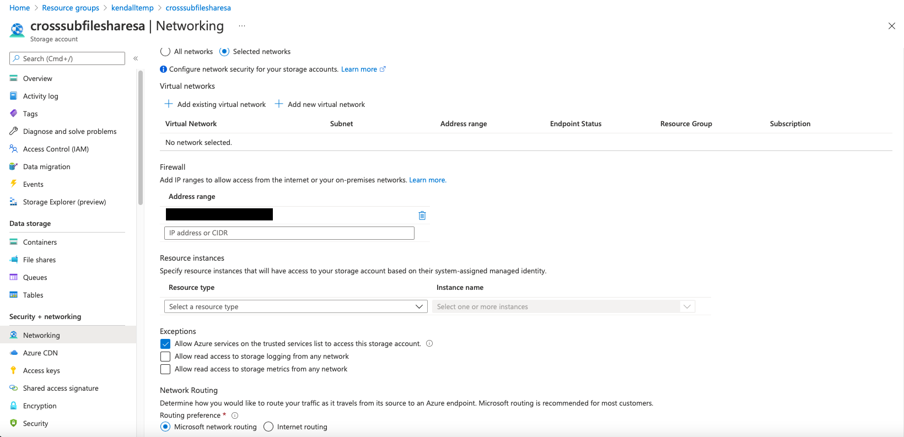

# Azure File CSI Driver

Use the below steps to set up Azure File CSI Driver on an Azure Kubernetes Service (AKS) cluster. This solution was created targeting the following requirements:
- Static Provisioning with an existing storage account and file share
- Azure file share is deployed in a different Azure subscription than the AKS Cluster
- Azure file share resource is protected via private endpoint  
- Pods running in the AKS cluster need Read-Only access to mounted storage

The following documentation builds on ideas shared in the following resources. Please refer to these if you need help with the initial Azure deployment. Keep in mind they will need to be tweaked, as they do not take into consideration the cross subscription requirement or the Read-Only requirement.
- [AKS: Persistent Volume Claim with an Azure File Storage protected with a Private Endpoint by Carlos Mendible](https://carlos.mendible.com/2021/08/02/aks-persistent-volume-claim-with-an-azure-file-storage-protected-with-a-private-endpoint/)
- [Use Azure Files with Private Endpoint as a persistent volume in a Multi-zone AKS](https://www.returngis.net/2021/08/utilizar-azure-files-con-private-link-como-persistent-volume-en-un-aks-multi-zona/)

## Prerequisites

Required Azure Resources: 
- 2 subscriptions in the same Azure Tenant:
  - 1 subscription that holds an AKS Cluster and networking resources: 
      - A VNET with 2 subnets:
         - 1 subnet will hold the AKS Cluster 
         - 1 subnet will hold the private endpoint for the storage account 
      - An AKS Cluster using a supported version that is >=1.21 
   - 1 subscription with a private-endpoint enabled storage account that holds an existing file share
 

Additional assumptions: 
- You have access to the AKS cluster API Server to create and modify resources 

## Setup Validation/ High-level walk-through 
Use the following steps to validate the required Azure Resources are set up appropriately before proceeding. 

### Subscription 1: AKS Cluster and Virtual Network 

1.  In the below example, make note of the following: 
   - Subscription: `Microsoft Azure Internal Consumption`
   - Resource Group: `pvc-test`
   - AKS Cluster: `aks-csitest`
   - Azure Virtal Network: `private-network`
   >NOTE: The Private endpoint, Network interface and Private DNS zone are all related to the Storage Account private endpoint. We will walk through this setup in the next section.
   

2. Within the Virtual Network, two subnets should be provisioned. One subnet is for AKS Node Pool VMSS and the other is for the Storage Account private endpoint. The VNET and AKS Subnet should be created first. Then, the subnet information should be passed in when creating the cluster via ARM, Bicep or using the Azure CLI. For information on creating/using an existing virtual network with AKS, click [here](https://docs.microsoft.com/en-us/azure/aks/configure-kubenet).  
   
   

### Subscription 2: Storage Account 
>Note: While this resource sits in a different subscription than the AKS Cluster and Virtual Network, it does exist within the same Azure Tenant. 

1. In the below example, make note of the following: 
   - Subscription: `raykao GBB`
   - Resource Group: `kendalltemp`
   - Storage Account: `crosssubfilesharesa`
   

2. Within the storage account, ensure you have an existing file share that you will be mounting to the pod via the Azure File CSI Driver. Make note of the following: 
   - File Share Name: `test`  
   - Share size: `5TiB`
   

3. Within the file share, I have uploaded an `index.php` file that will be used to test the share is mounted successfully in a future step. I have included this file in the `example-files` directory. 
   

4. Let's validate the networking configuration for the storage account via the `Networking` tab via the left sidebar. A few noteable callouts: 
   - Under the `Firewalls and virtual networks` tab on the top of the networking view, ensure you are only allowing access from `selected networks`. 
   - Add your local IP address if you would like to allow access from your local machine 
  
   

5. Switch to the `Private endpoint connections` tab on the top of the page to create and/or verify the existence of a private endpoint for the Storage Account in the appropriate VNET and Subnet. 

   1. Use the Subscription dropdown to select your **secondary subscription** in order to access the resource group holding the AKS Cluster and related networking components. The `Name` of the private endpoint is up to you.
      
      

   2. Next, ensure the `Target sub-resource` within the Storage Account is set to `file`.
      

   3. Proceeed to the `Configuration` step and follow the below steps: 
      - From the `Virtual Network` dropdown, select the VNET you created to hold your AKS and private endpoint subnets.
      - From the `Subnet` dropdown, select the subnet you created to hold the private endpoint specifically.
      - Ensure you leave the `Integrate with private DNS zone` set to true. The configuration defaults can be left as-is.
      

   4. Confirm your private endpoint was created successfully via the `Private endpoint connections` tab.
      
   
   5. Return to the AKS Subscription and validate the Private endpoint, Network interface and Private DNS zone related to the Storage Account private endpoint were created successfully. For additional information on Azure Private Link, view the following resources: 
      - [What is an Azure Private Endpoint](https://docs.microsoft.com/en-us/azure/private-link/private-endpoint-overview)
      - [Private Endpoint DNS Configuration](https://docs.microsoft.com/en-us/azure/private-link/private-endpoint-dns)
      - [Azure VNET Integration Patterns](https://github.com/fguerri/AzureVNetIntegrationPatterns)


## Instructions

1. Clone this repo in order to make changes locally. 

   ```bash
   git clone https://github.com/kendallroden/AKS-Demos
   ```

2. Using a YAML editor of your choice, navigate to `azure-files-csi-driver/example-file` folder and open `cross-sub-pv-pvc.yaml`.

3. Enter the required values to customize the Persistent Volume and Persistent Volume Claim based on your environment configuration. Save the file when you are done editing. 
   > NOTE: Values that need to be replaced are in UPPERCASE. 

4. Next, open the file `deploy.yaml` in the same directory and replace `PERSISTENT_VOLUME_CLAIM_NAME` with the name assigned to the Persistent Volume Claim in step 3. Save the file when you are done editing.

5. Using kubectl, create the PV and PVC resources in the appropriate namespace in your AKS Cluster.
   
   ```bash
   kubectl apply -f cross-sub-pv-pvc.yaml -n YOUR_NAMESPACE
   ```

6. In order to validate the Persistent Volume is successfully bound to the Persistent Volume Claim, run the following commands: 
   
   ```bash
   kubectl get pv -n YOUR_NAMESPACE 
   kubectl get pvc -n YOUR_NAMESPACE 
   ```
   Your output should mirror the below:
   

   If you need to troubleshoot, use the following commands to get insight into potential issues:
   
   ```bash
   kubectl describe pv YOUR_PV_NAME -n YOUR_NAMESPACE 
   kubectl describe pvc YOUR_PVC_NAME -n YOUR_NAMESPACE 
   ```

7. After validating the PV is bound, create the Deployment and the Service (used for testing purposes) in the same namespace from step 5.
   
   ```bash
   kubectl apply -f deloy.yaml -n YOUR_NAMESPACE
   ```
8. Validate the deployment was successful use the commands below. Your pods should be running, and your service should be created. It may take a bit for your service External-IP to resolve.  
   
   ```bash
   kubectl get pods -n YOUR_NAMESPACE    
   kubectl get service -n YOUR_NAMESPACE 
   ```

   If you need to troubleshoot the deployment or the service:

   ```bash
   kubectl describe deployment YOUR_DEPLOYMENT_NAME -n YOUR_NAMESPACE
   kubectl describe service YOUR_SERVICE_NAME -n YOUR_NAMESPACE 
   ```

9. If you have not already done so, add the `index.php` file from the `example-files` directory into the mounted file share.

10. Run the following command to exec into one of the pods to validate the file share has been successfully mounted with all of the existing file share contents: 
   ```bash
   kubectl exec -it YOUR_POD_NAME -- bash 
   ```
Once you are inside of the pod, run `ls` to view the contents of the file share mounted to the pod. You should see the `index.php` file. As an additional validation step, navigate to the External-IP of the service. 


